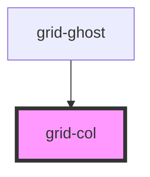

# grid-col

## Examples

```.html
  <grid-col>
    <!-- rest of the grid -->
  </grid-col>
```

<!-- Auto Generated Below -->


## Properties

| Property        | Attribute         | Description                                                        | Type      | Default |
| --------------- | ----------------- | ------------------------------------------------------------------ | --------- | ------- |
| `col`           | `col`             | Number of columns - As it's mobile first, that's the default size. | `number`  | `0`     |
| `colL`          | `col-l`           | Number of columns - L                                              | `number`  | `0`     |
| `colM`          | `col-m`           | Number of columns - M                                              | `number`  | `0`     |
| `colS`          | `col-s`           | Number of columns - S                                              | `number`  | `0`     |
| `colXL`         | `col-xl`          | Number of columns - XL                                             | `number`  | `0`     |
| `isCentered`    | `center`          | Is centered                                                        | `boolean` | `false` |
| `offset`        | `offset`          | Offset                                                             | `number`  | `0`     |
| `offsetL`       | `offset-l`        | Offset - L                                                         | `number`  | `0`     |
| `offsetM`       | `offset-m`        | Offset - M                                                         | `number`  | `0`     |
| `offsetRight`   | `offset-right`    | Offset right                                                       | `number`  | `0`     |
| `offsetRightL`  | `offset-right-l`  | Offset right - L                                                   | `number`  | `0`     |
| `offsetRightM`  | `offset-right-m`  | Offset right - M                                                   | `number`  | `0`     |
| `offsetRightS`  | `offset-right-s`  | Offset right - S                                                   | `number`  | `0`     |
| `offsetRightXL` | `offset-right-xl` | Offset right - XL                                                  | `number`  | `0`     |
| `offsetS`       | `offset-s`        | Offset - S                                                         | `number`  | `0`     |
| `offsetXL`      | `offset-xl`       | Offset - XL                                                        | `number`  | `0`     |


## Dependencies

### Used by

 - [grid-ghost](../grid-ghost)

### Graph


----------------------------------------------

*Built with [StencilJS](https://stenciljs.com/)*
