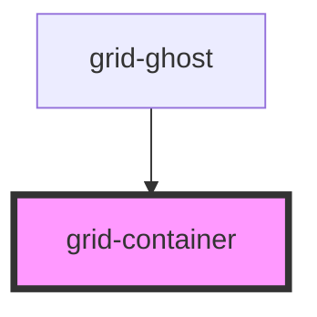

# grid-row

## Examples

```.html
  <grid-row>
    <!-- rest of the grid -->
  </grid-row>
```

<!-- Auto Generated Below -->


## Slots

| Slot | Description      |
| ---- | ---------------- |
|      | The default slot |


## Dependencies

### Used by

 - [grid-ghost](../grid-ghost)

### Graph


----------------------------------------------

*Built with [StencilJS](https://stenciljs.com/)*
