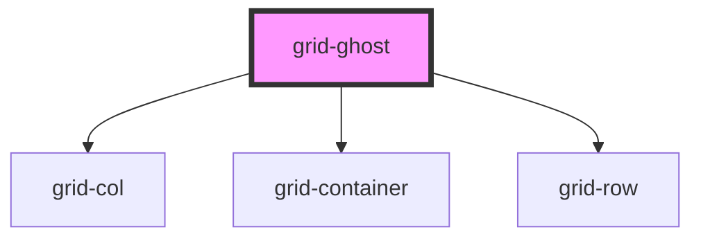

# grid-row

## Examples

```.html
  <grid-row>
    <!-- rest of the grid -->
  </grid-row>
```

<!-- Auto Generated Below -->


## Dependencies

### Depends on

- [grid-col](../grid-col)
- [grid-container](../grid-container)
- [grid-row](../grid-row)

### Graph


----------------------------------------------

*Built with [StencilJS](https://stenciljs.com/)*
