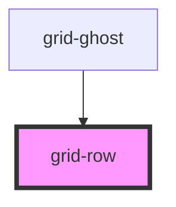

# grid-container

## Examples

```.html
  <grid-container>
    <!-- rest of the grid -->
  </grid-container>
```

<!-- Auto Generated Below -->


## Properties

| Property         | Attribute         | Description               | Type      | Default |
| ---------------- | ----------------- | ------------------------- | --------- | ------- |
| `alignItems`     | `align-items`     | Align Items               | `string`  | `''`    |
| `isCentered`     | `center`          | Is centered               | `boolean` | `false` |
| `isReversed`     | `reverse`         | Is reversed               | `boolean` | `false` |
| `isXCentered`    | `x-center`        | Is centered on the x axis | `boolean` | `false` |
| `isYCentered`    | `y-center`        | Is centered on the y axis | `boolean` | `false` |
| `justifyContent` | `justify-content` | Justify content           | `string`  | `''`    |


## Dependencies

### Used by

 - [grid-ghost](../grid-ghost)

### Graph


----------------------------------------------

*Built with [StencilJS](https://stenciljs.com/)*
