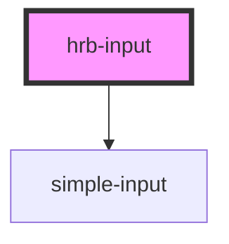

# hrb-input (deprecated)

Use [`simple-input`](../simple-input/readme.md) for new code. This compatibility adapter retains the original props, methods, and event target for at least one release after v0.3.0. It renders `hrb-input > simple-input > input`; update direct-child CSS selectors accordingly. New native-control props are available on `simple-input` only. See the [migration and native API guide](../../../readme.md#migrating-from-hrb-input).

<!-- Auto Generated Below -->

> **[DEPRECATED]** Use simple-input. This adapter retains the pre-0.4 input API.

## Properties

| Property          | Attribute          | Description                                                                   | Type                            | Default     |
| ----------------- | ------------------ | ----------------------------------------------------------------------------- | ------------------------------- | ----------- |
| `disabled`        | `disabled`         |                                                                               | `boolean`                       | `false`     |
| `idInput`         | `id-input`         |                                                                               | `string`                        | `''`        |
| `inputClassnames` | `input-classnames` |                                                                               | `string`                        | `''`        |
| `label`           | `label`            |                                                                               | `string \| undefined`           | `undefined` |
| `labelClassnames` | `label-classnames` |                                                                               | `string`                        | `''`        |
| `maxlength`       | `maxlength`        |                                                                               | `number`                        | `0`         |
| `name`            | `name`             |                                                                               | `string`                        | `''`        |
| `pattern`         | `pattern`          | String or programmatic RegExp; preserves historical partial-match validation. | `RegExp \| string \| undefined` | `undefined` |
| `placeholder`     | `placeholder`      |                                                                               | `string \| undefined`           | `undefined` |
| `prefixInput`     | `prefix-input`     |                                                                               | `string`                        | `''`        |
| `readonly`        | `readonly`         |                                                                               | `boolean`                       | `false`     |
| `required`        | `required`         |                                                                               | `boolean`                       | `false`     |
| `type`            | `type`             |                                                                               | `string`                        | `'text'`    |
| `value`           | `value`            |                                                                               | `string`                        | `''`        |

## Events

| Event          | Description                                                               | Type                  |
| -------------- | ------------------------------------------------------------------------- | --------------------- |
| `valueChanges` | Emitted once on the legacy host, preserving its event target and payload. | `CustomEvent<string>` |

## Methods

### `getValue() => Promise<string>`

Return the input's current value.

#### Returns

Type: `Promise<string>`

### `isValid() => Promise<boolean>`

Legacy required/maxlength/pattern check, not the full native constraint-validation API.

#### Returns

Type: `Promise<boolean>`

## Dependencies

### Depends on

- [simple-input](../simple-input)

### Graph

----------------------------------------------

*Built with [StencilJS](https://stenciljs.com/)*
