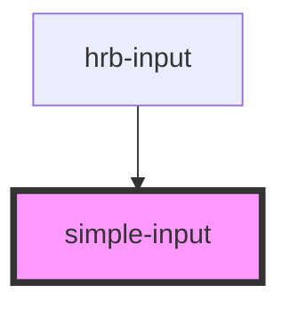

# simple-input

A light-DOM wrapper around a native `<input>`, not an `HTMLInputElement` subclass. Declared native props are forwarded; arbitrary host attributes are not. Use `label` (preferred) or `accessible-label` for its accessible name, `described-by` for help text, and `id-input` for the native ID. See the [native API and migration guide](../../../readme.md#native-elements-not-native-subclasses) for form behavior, validation differences, and upgrading from `hrb-input`.

<!-- Auto Generated Below -->

## Properties

| Property          | Attribute          | Description                                                                                                                                                                    | Type                                                                                               | Default     |
| ----------------- | ------------------ | ------------------------------------------------------------------------------------------------------------------------------------------------------------------------------ | -------------------------------------------------------------------------------------------------- | ----------- |
| `accessibleLabel` | `accessible-label` | Accessible name on the native input when no visible label is available. Prefer label.                                                                                          | `string \| undefined`                                                                              | `undefined` |
| `autocomplete`    | `autocomplete`     | Native autocomplete token(s), such as email or current-password.                                                                                                               | `string \| undefined`                                                                              | `undefined` |
| `describedBy`     | `described-by`     | Space-separated IDs of descriptions for the native input (aria-describedby).                                                                                                   | `string \| undefined`                                                                              | `undefined` |
| `disabled`        | `disabled`         | Disable the native input and omit it from form submission.                                                                                                                     | `boolean`                                                                                          | `false`     |
| `form`            | `form`             | ID of the form owning the native input.                                                                                                                                        | `string \| undefined`                                                                              | `undefined` |
| `idInput`         | `id-input`         | Native input ID (host id stays on the custom element). Use a unique ID per control.                                                                                            | `string`                                                                                           | `''`        |
| `inputClassnames` | `input-classnames` | Additional classes on the native input, not the host.                                                                                                                          | `string`                                                                                           | `''`        |
| `inputmode`       | `inputmode`        | Native virtual-keyboard hint.                                                                                                                                                  | `"decimal" \| "email" \| "none" \| "numeric" \| "search" \| "tel" \| "text" \| "url" \| undefined` | `undefined` |
| `label`           | `label`            | Visible label associated with the native input.                                                                                                                                | `string \| undefined`                                                                              | `undefined` |
| `labelClassnames` | `label-classnames` | Additional classes on the label, not the host.                                                                                                                                 | `string`                                                                                           | `''`        |
| `max`             | `max`              | Native maximum value for number/date-like inputs.                                                                                                                              | `string \| undefined`                                                                              | `undefined` |
| `maxlength`       | `maxlength`        | Native maximum length; zero means no limit for compatibility.                                                                                                                  | `number`                                                                                           | `0`         |
| `min`             | `min`              | Native minimum value for number/date-like inputs.                                                                                                                              | `string \| undefined`                                                                              | `undefined` |
| `minlength`       | `minlength`        | Native minimum length; checked by browser validity, not isValid().                                                                                                             | `number \| undefined`                                                                              | `undefined` |
| `multiple`        | `multiple`         | Allow multiple values for native types that support it.                                                                                                                        | `boolean`                                                                                          | `false`     |
| `name`            | `name`             | Native input name used in form submission.                                                                                                                                     | `string`                                                                                           | `''`        |
| `pattern`         | `pattern`          | Pattern used by isValid(). String patterns and programmatic RegExp values are supported. String patterns retain the component's historical partial-match validation semantics. | `RegExp \| string \| undefined`                                                                    | `undefined` |
| `placeholder`     | `placeholder`      | Native placeholder; not a replacement for a label.                                                                                                                             | `string \| undefined`                                                                              | `undefined` |
| `prefixInput`     | `prefix-input`     | Prefix for the native input ID when name is provided; prefer idInput.                                                                                                          | `string`                                                                                           | `''`        |
| `readonly`        | `readonly`         | Make the native input read-only.                                                                                                                                               | `boolean`                                                                                          | `false`     |
| `required`        | `required`         | Native required constraint.                                                                                                                                                    | `boolean`                                                                                          | `false`     |
| `step`            | `step`             | Native step interval, or any.                                                                                                                                                  | `string \| undefined`                                                                              | `undefined` |
| `type`            | `type`             | Native input type, or the legacy zip-code preset (text with a US ZIP pattern).                                                                                                 | `string`                                                                                           | `'text'`    |
| `value`           | `value`            | Set the current value; user edits are exposed through getValue() and valueChanges.                                                                                             | `string`                                                                                           | `''`        |

## Events

| Event          | Description                                                       | Type                  |
| -------------- | ----------------------------------------------------------------- | --------------------- |
| `valueChanges` | Emitted with the current value on native input and change events. | `CustomEvent<string>` |

## Methods

### `getValue() => Promise<string>`

Return the input's current value.

#### Returns

Type: `Promise<string>`

### `isValid() => Promise<boolean>`

Legacy required/maxlength/pattern check, not the full native constraint-validation API.

#### Returns

Type: `Promise<boolean>`

## Dependencies

### Used by

 - [hrb-input](../input)

### Graph

----------------------------------------------

*Built with [StencilJS](https://stenciljs.com/)*
